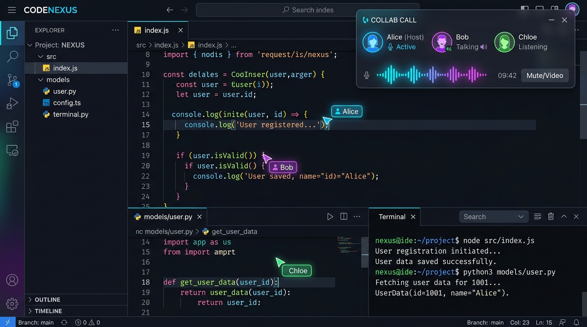

# DevAssembly (Vyoma Platform)

> **Real-Time Collaborative Coding, Sandboxed Execution & Developer Marketplace Platform**

DevAssembly (Vyoma) is a full-stack, enterprise-ready collaborative IDE and talent marketplace platform built for synchronous software engineering, rapid prototyping, and IP commercialization.

---

## 🌟 Visual Showcase

### 1. Collaborative IDE & Sandboxed Execution
Multi-user Monaco editor sessions with real-time cursor tracking, WebRTC voice channels, and sandboxed Node.js/Python execution environments.



### 2. Marketplace & Talent Ecosystem
Fixed-price project sales, live bidding auctions, developer reputation tracking, and employer hiring workflows.


---

## ✨ Key Platform Features

- 🚀 **Real-Time Collaborative Editor**: Powered by Socket.IO & Monaco Editor. Supports multi-cursor indicators, active line highlights, live document synchronization, and multi-file tree management.
- 🎙️ **WebRTC Peer-to-Peer Voice Channels**: Built-in voice communication per collaboration room without third-party audio service dependencies.
- ⚡ **Sandboxed Execution Engine (`/api/execute`)**: Isolated Node.js and Python execution with 2-second hard timeouts, 64KB memory/output buffers, path traversal sanitization, and dedicated per-IP rate limiting (max 10 executions/min).
- 🛒 **Project Marketplace & Auction Hub**: Buy and sell source code projects or list them for live timed auctions with automatic winner resolution.
- 💼 **Talent Discovery & Hiring Portal**: Employer accounts can hire developers with automated in-app notifications and SMTP transactional emails (Resend integration).
- 🗄️ **Automatic PostgreSQL Schema Initialization**: Connect to PostgreSQL (Neon, Railway, Supabase, RDS) with zero initial SQL script manual setup. Includes local JSON fallback (`db.json`) for local development without DB dependencies.
- 🔒 **Hardened Security Architecture**: JWT authentication, bcrypt password hashing, Helmet HTTP security headers, CORS origin whitelisting, express rate limiters, and complete `.env` secrecy.

---

## 🏗️ System Architecture

```mermaid
graph TD
    User([Developer / Employer]) -->|HTTPS / WSS| Frontend[React + Vite + Monaco IDE]
    Frontend -->|HTTP API| Express[Express Server API]
    Frontend -->|Socket.IO| SocketServer[Real-Time Socket Engine]
    
    subgraph Security Layer
        Express --> Auth[JWT & OAuth Guard]
        Express --> RateLimiter[IP & Execution Rate Limiters]
        Express --> StorageCaps[Room File Storage Caps 100KB/2MB]
    end

    subgraph Execution Sandbox
        Express --> Sandbox[Sandboxed Code Runner]
        Sandbox --> NodeRunner[Node.js Process (2s limit)]
        Sandbox --> PyRunner[Python3 Process (2s limit)]
    end

    subgraph Data Layer
        Express --> Postgres[(PostgreSQL Database)]
        Express -.->|Dev Fallback| LocalDB[(Local db.json)]
    end
```

---

## 🚀 Quick Start (One Command via Docker)

The easiest way to run the entire DevAssembly platform (Frontend + Backend + PostgreSQL) is using Docker Compose:

```bash
docker compose up --build
```

Access the applications:
- **Frontend App**: `http://localhost:5173` (or `http://localhost:5000` when served via backend container)
- **Backend API**: `http://localhost:5000`
- **PostgreSQL Database**: `localhost:5432`

---

## 💻 Manual Setup & Local Development

### 1. Prerequisites
- **Node.js**: `v18.0.0` or higher
- **npm**: `v9.0.0` or higher
- **Python 3**: (Optional, for Python code execution support)
- **PostgreSQL**: (Optional, system falls back to `db.json` if PostgreSQL is not active)

### 2. Environment Configuration

Copy environment templates in both `backend` and `frontend`:

```bash
# Backend Environment Setup
cp backend/.env.example backend/.env

# Frontend Environment Setup
cp frontend/.env.example frontend/.env
```

#### Key Environment Variables Reference

**Backend (`backend/.env`)**:
| Variable | Description | Default |
| :--- | :--- | :--- |
| `PORT` | Express server port | `5000` |
| `JWT_SECRET` | Secret key for signing authentication tokens | *Required* |
| `ALLOWED_ORIGINS` | Permitted CORS frontend origins | `http://localhost:5173` |
| `PGHOST` | PostgreSQL Host | `localhost` |
| `PGUSER` | PostgreSQL Username | `postgres` |
| `PGPASSWORD` | PostgreSQL Password | `postgres` |
| `PGDATABASE` | PostgreSQL Database Name | `vyoma` |
| `PGPORT` | PostgreSQL Port | `5432` |
| `GOOGLE_CLIENT_ID` / `SECRET` | Google OAuth credentials | *Optional* |
| `GITHUB_CLIENT_ID` / `SECRET` | GitHub OAuth credentials | *Optional* |

---

### 3. Launching Backend & Frontend

#### Terminal 1: Backend Server
```bash
cd backend
npm install
npm run dev
```

Backend will start on `http://localhost:5000`.

#### Terminal 2: Frontend Client
```bash
cd frontend
npm install
npm run dev
```

Frontend will start on `http://localhost:5173`.

---

## 🔒 Security & Execution Sandboxing

DevAssembly follows strict security practices to ensure public deployment readiness:

1. **Sandboxed Code Execution**:
   - Only `javascript` (Node.js) and `python` (Python 3) execution environments are supported.
   - Raw `bash` execution is disabled.
   - 3-second hard wall-clock execution limit per process.
   - Maximum output buffer capped at 64KB.
   - Filenames are sanitized via `path.basename` to prevent path traversal attacks (`../`).
   - Rate limited to 10 execution requests per minute per IP address.

2. **Storage Controls & Storage Caps**:
   - Room files are capped at **100KB per file**.
   - Maximum **50 files per collaboration room**.
   - Total room storage capped at **2MB**.
   - Path traversal checks prevent absolute or escape path creations (`..`, `\0`).

3. **Secrets Hygiene**:
   - `.env` files are strictly excluded from git tracking and release packages via `.gitignore`.
   - Complete template coverage via `.env.example`.

---

## ☁️ Production Deployment Guide

### Deploying to Render / Railway / VPS

1. **Database**: Create a managed PostgreSQL instance (e.g., Neon.tech, Render Postgres, Supabase).
2. **Environment Variables**:
   - Set `NODE_ENV=production`
   - Set `PGHOST`, `PGUSER`, `PGPASSWORD`, `PGDATABASE`, `PGPORT` with your Postgres connection details.
   - Generate a secure 64-character hex `JWT_SECRET`:
     ```bash
     node -e "console.log(require('crypto').randomBytes(64).toString('hex'))"
     ```
   - Update `ALLOWED_ORIGINS` to your production frontend URL.
3. **Build Commands**:
   - Backend: `npm install --production` -> `npm start`
   - Frontend: `npm install` -> `npm run build` -> Serve `dist/` folder via Nginx or Render Static Site.

---

## 📜 License

MIT License. Free for personal, commercial, and enterprise usage.
